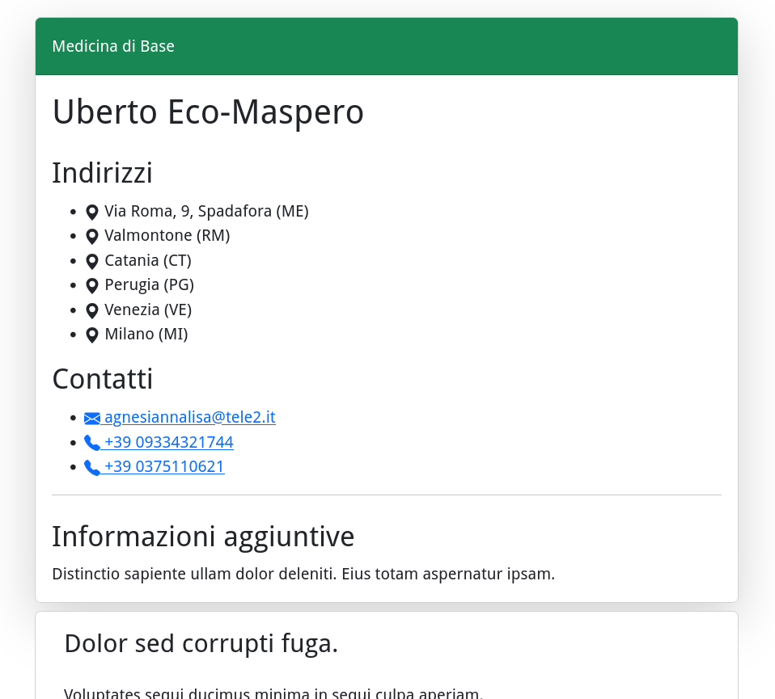

# Djeography

Djeography is a  django application for participatory and activist cartography.

</img> </img>

See an [example project](example/) and/or check out a [demo](https://gfabiani4.eu.pythonanywhere.com).

## Quick start
1. Install `djeography`
    ```
    $ pip install git+https://github.com/g-fabiani/djeography
    ```
2. Add `djeography` and its dependencies to `INSTALLED_APPS` in `settings.py` for your project:
    ```
    INSTALLED_APPS = [
        ...,
        'leaflet',
        'djgeojson',
        'tinymce',
        'djeography'
    ]
    ```
3. Include djeography URLconf in your project `urls.py`:
    ```
    path('map/', include('djeography.urls')),
    ```

4. Add configurations for `django-leaflet`
    ```
    LEAFLET_CONFIG = {
        'FORCE_IMAGE_PATH': True,
        'DEFAULT_CENTER': [41.919, 14.414],
        'DEFAULT_ZOOM': 6,
        'MAX_ZOOM': 19,
        'RESET_VIEW': False,
        'PLUGINS': {
            'beautify-marker': {
                'js': 'map/beautifymarker/leaflet-beautify-marker-icon.js',
                'css': 'map/beautifymarker/leaflet-beautify-marker-icon.css'
            },
            'control-geocoder': {
                'js': 'https://unpkg.com/leaflet-control-geocoder/dist/Control.Geocoder.js',
                'css': 'https://unpkg.com/leaflet-control-geocoder/dist/Control.Geocoder.css',
                'auto-include': True
            },
            'marker-cluster': {
                'js': 'https://unpkg.com/leaflet.markercluster@1.4.1/dist/leaflet.markercluster.js',
                'css': ['https://unpkg.com/leaflet.markercluster@1.4.1/dist/MarkerCluster.css',
                        'https://unpkg.com/leaflet.markercluster@1.4.1/dist/MarkerCluster.Default.css']
            },
            'featuregroup-subgroup': {
                'js': 'https://unpkg.com/leaflet.featuregroup.subgroup@1.0.2/dist/leaflet.featuregroup.subgroup.js'
            }
        }
    }
    ```
5. Run `python manage.py migrate` to create the models in your database.

6. Your map will be available at [http://127.0.0.1:8000/map/fullscreen/](http://127.0.0.1:8000/map/fullscreen/).


## Configuration

Add a new section in your settings:

```
DJEOGRAPHY_CONFIG = {
    # conf here
}
```

### Pagination
The list view for entities is paginated by 6 by default. You can specify a different number of entities for page using:

```
'PAGINATION': 10
```
### Evaluation Levels
By default we made available 3 evaluation levels for reported entities:
 - Negative
 - Mixed
 - Positive

You can add, remove or change evaluation levels in the admin.

### Marker Colors

You can set the marker color for each evaluation level in the admin.

The color of markers having no evaluation level is controlled in the application configuration (accepts html color names or hex codes):

```
'DEFAULT_MARKER_COLOR': 'purple'
```