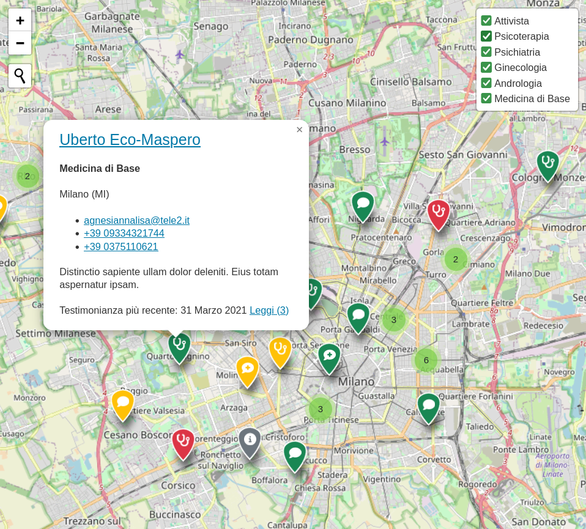

# Djeography

Djeography is a  django application for participatory and activist cartography.



See an [example project](example/) and/or check out a [demo](https://gfabiani4.eu.pythonanywhere.com).

## Quick start
Install `djeography`
```
$ pip install git+https://github.com/g-fabiani/djeography
```
Add `djeography` and its dependencies to `INSTALLED_APPS` in `settings.py` for your project:
```
INSTALLED_APPS = [
    ...,
    'leaflet',
    'djgeojson',
    'tinymce',
    'djeography'
]
```
Include djeography URLconf in your project `urls.py`:
```
path('map/', include('djeography.urls')),
```

Add configurations for `django-leaflet`
```
LEAFLET_CONFIG = {
    'FORCE_IMAGE_PATH': True,
    'DEFAULT_CENTER': [41.919, 14.414],
    'DEFAULT_ZOOM': 6,
    'MAX_ZOOM': 19,
    'RESET_VIEW': False,
    'PLUGINS': {
        'awesome-markers': {
            'js': 'https://cdnjs.cloudflare.com/ajax/libs/Leaflet.awesome-markers/2.0.2/leaflet.awesome-markers.min.js',
            'css': 'https://cdnjs.cloudflare.com/ajax/libs/Leaflet.awesome-markers/2.0.2/leaflet.awesome-markers.css',
        },
        'beautify-marker': {
            'js': 'map/beautifymarker/leaflet-beautify-marker-icon.js',
            'css': 'map/beautifymarker/leaflet-beautify-marker-icon.css'
        },
        'control-geocoder': {
            'js': 'https://unpkg.com/leaflet-control-geocoder/dist/Control.Geocoder.js',
            'css': 'https://unpkg.com/leaflet-control-geocoder/dist/Control.Geocoder.css',
            'auto-include': True
        },
        'marker-cluster': {
            'js': 'https://unpkg.com/leaflet.markercluster@1.4.1/dist/leaflet.markercluster.js',
            'css': ['https://unpkg.com/leaflet.markercluster@1.4.1/dist/MarkerCluster.css',
                    'https://unpkg.com/leaflet.markercluster@1.4.1/dist/MarkerCluster.Default.css']
        },
        'featuregroup-subgroup': {
            'js': 'https://unpkg.com/leaflet.featuregroup.subgroup@1.0.2/dist/leaflet.featuregroup.subgroup.js'
        }
    }
}
```
Run `python manage.py migrate` to create the models in your database.

Your map will be available at [http://127.0.0.1:8000/map/fullscreen/](http://127.0.0.1:8000/map/fullscreen/).
